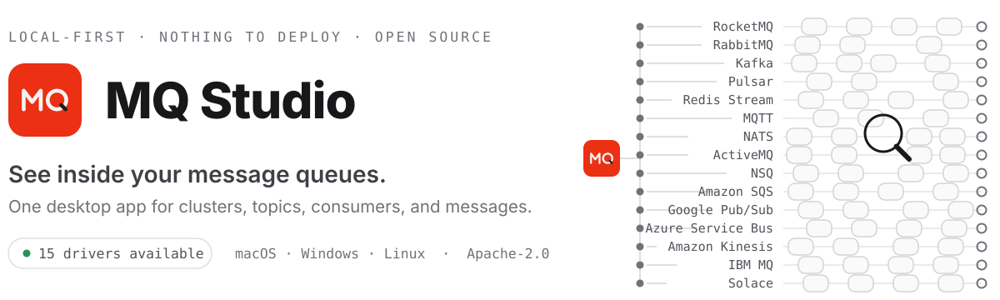

<div align="center">
  <picture>
    <source media="(prefers-color-scheme: dark)" srcset="docs/images/hero-dark.svg">
    
  </picture>
</div>

<p align="center">
  <a href="https://mq-studio.amigoer.com/en/"></a>
  <a href="https://github.com/amigoer/mq-studio/releases/latest"></a>
  <a href="https://github.com/amigoer/mq-studio/releases"></a>
  <a href="https://app.codecov.io/gh/amigoer/mq-studio"></a>
  <a href="LICENSE"></a>
</p>

<p align="center">
  <a href="README.zh-CN.md">简体中文</a>&nbsp;&nbsp;·&nbsp;&nbsp;
  <a href="https://mq-studio.amigoer.com/en/">Download</a>&nbsp;&nbsp;·&nbsp;&nbsp;
  <a href="docs/INSTALL.md">Install guide</a>&nbsp;&nbsp;·&nbsp;&nbsp;
  <a href="#roadmap">Roadmap</a>&nbsp;&nbsp;·&nbsp;&nbsp;
  <a href="docs/ARCHITECTURE.md">Documentation</a>
</p>

<br>

<p align="center">
  <a href="docs/images/readme/overview.png"></a>
</p>
<p align="center">
  <sub>Cluster health, live throughput, consumer lag, and broker status — one glance after connecting.</sub>
</p>

## Why MQ Studio

Every message queue arrives with a console of its own — RocketMQ has one, Kafka has another,
RabbitMQ ships a management plugin. Different interfaces, different vocabulary, and every one
of them a service to deploy and keep alive.

MQ Studio is one client for all of them. Each broker is reached through a driver sitting
behind the same interface, so the pages and the workflow stay the same whichever system you
are connected to. Install the app, add a connection, and start working: there is no server
component to deploy, secure, or keep alive.

- **One interface, every broker** — drivers land one at a time, each taken to the same depth
- **Honest about what it connects to** — every connection reports what its endpoint can actually do, and the pages are drawn from that
- **Ready to use** — download, connect, work; no web console to stand up and maintain
- **Private by default** — configuration stays on your device and credentials are encrypted at rest
- **Cross-platform** — macOS, Windows, and Linux, with English and Chinese interfaces

RocketMQ, RabbitMQ, Kafka, Pulsar, Redis Stream, MQTT, NATS, ActiveMQ, NSQ, Amazon SQS, Google Pub/Sub, and Azure Service Bus are the drivers available today; [Driver support](#driver-support) has the rest.

## Features

| Area | What you can do |
| --- | --- |
| **Connections** | Manage multiple clusters with free-text groups, per-protocol endpoints and credentials, auto-connect, and encryption at rest |
| **Topics & Queues** | Create and inspect topics, queues, exchanges, and bindings, with their partitions, settings, and arguments; selectors match on fuzzy input and remember what you used |
| **Messages** | Query and trace, browse and follow a log, produce with keys and headers, resend and redeliver, and work through dead letters |
| **Consumers** | View groups, clients, subscriptions, and lag; reset offsets; handle retry and dead letters |
| **Cluster & Alerts** | Monitor brokers and nodes, runtime metrics, throughput, lag, disk usage, and desktop alerts |
| **Administration** | Manage access control and users, quotas, policies, and the settings behind each topic, queue, and group |
| **Personalization** | Switch theme and language, customize display, import or export configuration, and automatic update checks |

The rows above are the union across drivers; [Driver support](#driver-support) says which broker gets what.

## Product tour

Select any screenshot to open it at full resolution.

<table>
  <tr>
    <td width="50%" align="center">
      <a href="docs/images/readme/welcome-light.png"></a>
      <sub><strong>First launch</strong> — no connection yet: create one, or import a previous export.</sub>
    </td>
    <td width="50%" align="center">
      <a href="docs/images/readme/welcome-dark.png"></a>
      <sub><strong>Dark theme</strong> — the whole interface follows the system theme, or the one you pick.</sub>
    </td>
  </tr>
  <tr>
    <td width="50%" align="center">
      <a href="docs/images/readme/connections.png"></a>
      <sub><strong>Connections</strong> — every cluster in one list; double-click a row to open it in its own tab.</sub>
    </td>
    <td width="50%" align="center">
      <a href="docs/images/readme/new-connection.png"></a>
      <sub><strong>Adding a connection</strong> — pick the protocol, then fill in only the endpoints and credentials that protocol needs.</sub>
    </td>
  </tr>
  <tr>
    <td width="50%" align="center">
      <a href="docs/images/readme/topics.png"></a>
      <sub><strong>Topic operations</strong> — filter by type, then inspect queues, routing, and subscriptions in the detail panel.</sub>
    </td>
    <td width="50%" align="center">
      <a href="docs/images/readme/consumers.png"></a>
      <sub><strong>Consumer diagnostics</strong> — lag, consume TPS, and clients per group; reset or clone offsets queue by queue.</sub>
    </td>
  </tr>
  <tr>
    <td width="50%" align="center">
      <a href="docs/images/readme/cluster.png"></a>
      <sub><strong>Cluster monitoring</strong> — broker roles, throughput, disk water level, and messages in and out today.</sub>
    </td>
    <td width="50%" align="center">
      <a href="docs/images/readme/alerts.png"></a>
      <sub><strong>Alerts</strong> — active alerts derived from live cluster metrics, with the rules behind them.</sub>
    </td>
  </tr>
</table>

## Driver support

MQ Studio reaches every broker through a pluggable driver. Each driver declares its own
capabilities, so the interface only offers what the connected broker can actually do.

| Driver | Status | Notes |
| --- | --- | --- |
| **RocketMQ** 4.x / 5.x | ✅ Available | Full feature set through Admin APIs |
| **RabbitMQ** 3.x / 4.x | ✅ Available | Full management plane: queues, exchanges and bindings, connections and channels, browse and publish over AMQP, dead letters, virtual hosts, users and permissions, policies, definitions, shovels and federation |
| **Kafka** 3.x / 4.x | ✅ Available | Topics with their partitions, replicas and settings; consumer groups with per-partition lag and every offset reset Kafka offers; browsing and following a log; producing with keys, headers and an acknowledgement level; brokers, their effective settings and their log directories; ACLs and SCRAM users; client quotas; partition reassignment and preferred-leader election; and the cluster's open transactions |
| **Pulsar** 3.x / 4.x | ✅ Available | Topics with their partitions and storage kind; namespaces and the tenants above them, with TTL, retention and per-topic limits; subscriptions with backlog, delayed and unacknowledged counts, blocked-subscription detection, and cursor moves by time or to the earliest message; browsing and following a log without taking a subscription; sending with keys, ordering keys, properties and delayed delivery; brokers with their bundles and resource usage; dead-letter and retry topics found by the client libraries' naming convention; and role grants on namespaces and topics |
| **Redis Stream** 6.0+ | ✅ Available | Streams with their length, memory and entry range; consumer groups with lag and every reposition XGROUP SETID offers; browsing entries by time window or id, and writing them as ordered fields; the pending entries list with claim, auto-claim and acknowledge; the server's memory, persistence and slow log; standalone, sentinel and cluster; client connections; and ACL users with their key, channel and command rules |
| **MQTT** 3.1.1 / 5.0 | ✅ Available | Publish with QoS, retain and the 5.0 properties; a live subscribe workbench that reports what it dropped and when the session went down; topics from the broker's retained set; the $SYS tree where a broker publishes one; and — where the broker offers a management API, as EMQX and its peers do — connected clients and their sessions, their subscriptions, the cluster's nodes, and disconnecting a session. Mosquitto, EMQX, HiveMQ and VerneMQ |
| **NATS** 2.x | ✅ Available | JetStream streams with their subjects, retention, storage and replica set; consumers push and pull, with pending, unacknowledged and redelivered counts; browsing and following a stream by sequence; publishing on a subject, with a request that waits for a reply; a subjects workbench for core NATS, which stores nothing and delivers only to whoever is listening; purge by count, sequence or subject and deleting single messages; the cluster's servers with their routes and effective settings, read through $SYS or the monitoring endpoint; client connections with what each is subscribed to, and disconnecting one; and the accounts, with their JetStream usage against the caps they were given |
| **ActiveMQ** Classic 5.x / 6.x · Artemis 2.x | ✅ Available | One family, two brokers, told apart when the connection opens. Queues and topics with their depth, counters and settings; durable subscriptions on either product, created and removed; browsing that takes nothing off the destination, because it is a management operation on both; sending with JMS headers, properties and a priority; dead letters found by walking the declarations backwards, and retried back to the destinations they failed on; the broker with its store, journal and effective settings, and the brokers it bridges to; client connections with the protocol each speaks, and disconnecting one; and — where the broker's AMQP acceptor is reachable — watching a topic as messages arrive |
| **NSQ** 1.x | ✅ Available | One family, no admin protocol: everything an operator can ask is an HTTP call on the daemons that carry the messages. Topics with the depth they hold, split between the topic's own queue and its channels', summed across every nsqd carrying them; channels, which are this family's consumer groups, with their backlog, in-flight and deferred counts; creating, emptying, pausing and deleting either, on every daemon at once and in the discovery tier as well; publishing to one named daemon, repeated or held back for a delivery time; the cluster's nsqd beside the nsqlookupd that tell consumers where they are, with a warning when the two disagree; and who is connected, in both roles nsqd reports them in: consumers with the ready count that says which of them has stopped asking for work, and producers with what each has published. No message browse and no dead letters: nsqd hands a message to a consumer and stops holding it |
| **Amazon SQS** | ✅ Available | The first family with no address to type: a connection is a region and an AWS credential, and the SDK resolves the rest. Queues with what they are holding split three ways — available, in flight and delayed, which are three different problems; creating, editing, purging and deleting them, standard or FIFO; browsing, which goes through ReceiveMessage and carries the caveat that says so; sending with named attributes, a delay, a repeat, and the group and deduplication ids a FIFO queue requires; and dead letters found by walking every queue's redrive policy backwards. No consumer groups and no cluster, because SQS has neither |
| **Google Pub/Sub** | ✅ Available | The second family with no address to type: a connection is a project and a Google credential. The first whose objects come in two kinds — a topic holds nothing and fans a publish out to whatever subscribes at that instant, so the topics board leads with a subscription count and a topic with none is the fault it marks. Subscriptions as objects in their own right, with the whole of the delivery configuration on them: ack deadline, retention, retry backoff, filters, ordering, and where they give up to; creating and deleting either; browsing a subscription, which goes through Pull and carries the caveat that says so; publishing with attributes and an ordering key; restore points, and moving a subscription to one or to a moment in time; and dead letters found by inverting every subscription's policy. No backlog figure, because that one lives in Cloud Monitoring |
| **Azure Service Bus** | ✅ Available | The third hosted family and the first of them reached by dialling something: a namespace is a real address, so this one has an endpoint field where SQS has a region and Pub/Sub a project. Queues and topics on one board, because they are the same thing to create, configure and delete — a queue holds its messages and a topic holds none, copying each send into the subscriptions whose rules let it through. Subscriptions with the whole delivery contract on them, and rules on the routing page: objects with names, several to a subscription, each a SQL or correlation filter and optionally an action that rewrites the message on the way in. Browsing is a peek, so it is the one messages page here with no caveat at all — nothing is taken, nothing is locked, no delivery count moves, and a scheduled or deferred message no consumer would be offered shows up anyway. Sending with a subject, properties, a session key and a real delay; and dead letters read from the $DeadLetterQueue every queue and subscription is created with, and put back one at a time |
| Kinesis · IBM MQ · Solace and more | 📋 Planned | Full matrix below |

<details>
<summary><strong>Planned drivers, wire-compatible systems, and scope</strong></summary>
<br>

| Driver | Status | Notes |
| --- | --- | --- |
| **Amazon Kinesis** | 📋 Planned | Streams and shards |
| **IBM MQ** | 📋 Planned | Queues and channels over the administrative REST API |
| **Solace PubSub+** | 📋 Planned | Queues and topic endpoints over SEMP |

**Covered by an existing driver.** Wire-compatible systems do not get a driver of their own:
Redpanda, AutoMQ, WarpStream, Confluent, Amazon MSK, and Azure Event Hubs connect as Kafka;
EMQX, Mosquitto, HiveMQ, and VerneMQ as MQTT; Amazon MQ as ActiveMQ or RabbitMQ; Alibaba Cloud
and Tencent Cloud RocketMQ as RocketMQ. Each driver declares what its family can do and the
pages are drawn from that; probing an endpoint to narrow it per deployment is not built yet.

**Out of scope.** ZeroMQ and nanomsg have no broker and therefore no management plane. Celery,
Sidekiq, and BullMQ are application-level job queues layered on Redis or RabbitMQ rather than
message brokers.

</details>

ACL and some advanced operations depend on the broker version and configuration. The capability
model behind this table is described in [the multi-MQ design](docs/MULTI_MQ_DESIGN.md).

## Roadmap

Drivers land one at a time. Each one is taken to the depth RocketMQ already has — topics,
consumers, messages, cluster, and alerts — before the next one starts, so no driver ships as a
half-wired set of pages.

| Phase | Scope | Status |
| --- | --- | --- |
| 1 | RocketMQ 4.x / 5.x | ✅ Done |
| 2 | RabbitMQ | ✅ Done |
| 3 | Kafka | ✅ Done |
| 4 | Redis Stream | ✅ Done |
| 5 | Pulsar | ✅ Done |
| 6 | MQTT | ✅ Done |
| 7 | NATS | ✅ Done |
| 8 | ActiveMQ Classic / Artemis | ✅ Done |
| 9 | NSQ | ✅ Done |
| 10 | Amazon SQS | ✅ Done |
| 11 | Google Cloud Pub/Sub | ✅ Done |
| 12 | Azure Service Bus | ✅ Done |
| 13 | The remaining drivers, in the order listed under Driver support | 📋 Next |
| 14 | Agent features | 📋 Planned |

Agent work starts once driver coverage is in place, not before. Every driver already declares
what the connected broker can actually do, and that capability model is the foundation an agent
needs to work across brokers without offering operations the broker cannot perform. The scope
will be published here once the remaining drivers land.

This is a sequence, not a schedule: no dates are attached to it, and the order after Redis Stream can
change if there is enough demand for a driver further down the list.

## Download

**[mq-studio.amigoer.com](https://mq-studio.amigoer.com/en/)** is the shortest way in: the
download button on that page already points at the build for the system you are on, and the menu
beside it lists every other one.

| Platform | Package | Requires |
| --- | --- | --- |
| macOS Apple Silicon / Intel | `-mac-arm64.dmg` / `-mac-amd64.dmg` | macOS 12+ |
| Windows x64 / ARM64 | `-windows-amd64.exe` / `-windows-arm64.exe` | Windows 10+ |
| Debian / Ubuntu | `-linux-amd64.deb` / `-linux-arm64.deb` | GTK 4, WebKitGTK 6.0 |
| Fedora / RHEL | `-linux-amd64.rpm` / `-linux-arm64.rpm` | GTK 4, WebKitGTK 6.0 |
| Any Linux | `-linux-amd64.AppImage` / `-linux-arm64.AppImage` | GTK 4, WebKitGTK 6.0 |

The Linux packages are built against the GTK 4 stack, which means Ubuntu 24.04 or later,
Debian 13 or later, and equivalent releases elsewhere. Earlier distributions ship
WebKit2GTK 4.1 and cannot run these packages.

Packages are named `mq-studio-<version>-<os>-<arch>.<ext>`, where `os` is `mac`, `windows`, or
`linux` and `arch` is `amd64` or `arm64`. On a Mac, About This Mac tells you whether to take
`arm64` or `amd64`.

macOS builds are not signed by a registered Apple developer yet, so the first launch needs one
extra step — the disk image ships a helper for it. See **[INSTALL](docs/INSTALL.md)** for that
and for the per-platform install steps.

[GitHub Releases](https://github.com/amigoer/mq-studio/releases) carries the same files, plus the
`SHA256SUMS.txt` to verify a download against and every earlier version.

## Quick start

1. Open MQ Studio and create a connection.
2. Pick the protocol, then enter the endpoints and credentials the form asks for.
3. Save, connect, and choose a feature from the sidebar.

Your profiles and settings stay in the local user configuration directory. Configuration
exports contain plaintext credentials and should be stored securely.

## Development

Requires Go 1.25+, Node.js 20+, npm, and the [Wails 3 CLI](https://v3.wails.io).

```bash
go install github.com/wailsapp/wails/v3/cmd/wails3@latest
make install
make dev
```

Use `make check` to run project checks, `make package` to build a distributable, and
`make help` to list all commands.

## Docs

[Architecture](docs/ARCHITECTURE.md) · [Install](docs/INSTALL.md) · [Contributing](CONTRIBUTING.md) · [Changelog](CHANGELOG.md) · [Releasing](RELEASE.md) · [Roadmap](docs/ROADMAP.md)

## Community

Questions, requests, or thoughts on which driver should come next:
[GitHub Issues](https://github.com/amigoer/mq-studio/issues) · [linux.do](https://linux.do) (in Chinese)

## License

[Apache-2.0](LICENSE) © 2026 [amigoer](https://github.com/amigoer)
