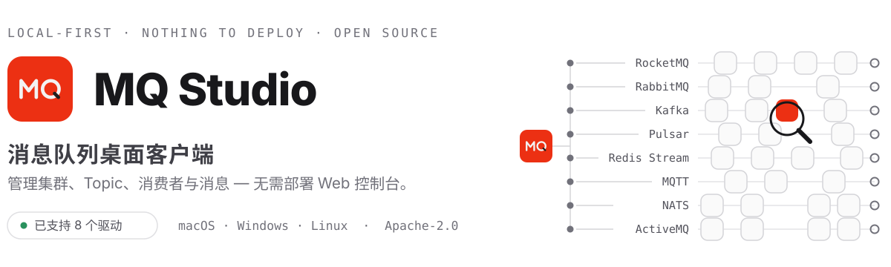

<div align="center">
  <picture>
    <source media="(prefers-color-scheme: dark)" srcset="docs/images/hero-dark.zh-CN.svg">
    
  </picture>
</div>

<p align="center">
  <a href="https://mq-studio.amigoer.com/"></a>
  <a href="https://github.com/amigoer/mq-studio/releases/latest"></a>
  <a href="https://github.com/amigoer/mq-studio/releases"></a>
  <a href="https://app.codecov.io/gh/amigoer/mq-studio"></a>
  <a href="LICENSE"></a>
</p>

<p align="center">
  <a href="README.md">English</a>&nbsp;&nbsp;·&nbsp;&nbsp;
  <a href="https://mq-studio.amigoer.com/">下载</a>&nbsp;&nbsp;·&nbsp;&nbsp;
  <a href="docs/INSTALL.zh-CN.md">安装说明</a>&nbsp;&nbsp;·&nbsp;&nbsp;
  <a href="#开发计划">开发计划</a>&nbsp;&nbsp;·&nbsp;&nbsp;
  <a href="docs/ARCHITECTURE.md">文档</a>
</p>

<br>

<p align="center">
  <a href="docs/images/readme/overview.png"></a>
</p>
<p align="center">
  <sub>连接之后，集群健康、实时吞吐、消费堆积与 Broker 状态一眼可见。</sub>
</p>

## 为什么用 MQ Studio

每一种消息队列都自带一个控制台 —— RocketMQ 一个，Kafka 另一个，RabbitMQ 带着它的
management 插件。界面不同、叫法不同，而且每一个都是要部署、要值守的服务。

MQ Studio 是它们共同的客户端。每一种消息中间件都通过一个驱动接入同一套接口，
所以不管连的是哪一个系统，页面和操作方式都是同一套。安装应用、添加连接，然后开始
工作：没有需要部署、加固和值守的服务端组件。

- **一套界面，所有中间件** — 驱动一个一个接入，每一个都做到同样的深度
- **如实呈现所连的端点** — 每个连接上报它究竟能做什么，界面据此绘制
- **安装即用** — 下载、连接、开工，不需要搭建和维护 Web 控制台
- **数据留在本机** — 配置保存在当前设备，凭证加密存储
- **跨平台与双语** — 支持 macOS、Windows、Linux，提供中英文界面

目前可以连接的驱动是 RocketMQ、RabbitMQ、Kafka、Pulsar、Redis Stream、MQTT、NATS、ActiveMQ 和 NSQ，其余进度见[驱动支持](#驱动支持)。

## 功能

| 模块 | 能力 |
| --- | --- |
| **连接** | 管理多个集群，支持自由文本分组、按协议填写的接入地址与凭证、自动连接，凭证加密存储 |
| **Topic 与队列** | 创建和查看 Topic、队列、交换机与绑定，以及它们的分区、配置与参数；选择器支持模糊匹配与最近使用记忆 |
| **消息** | 查询与追踪、浏览与跟随日志、带 Key 和 Header 生产、重发与重新投递、处理死信 |
| **消费者** | 查看消费组、客户端、订阅与堆积；重置位点；处理重试与死信 |
| **集群与告警** | 监控 Broker 与节点、运行指标、吞吐、堆积、磁盘状态与桌面告警 |
| **管理能力** | 管理访问控制与用户、配额、策略，以及每个 Topic、队列和消费组背后的配置 |
| **个性化** | 切换主题与语言、自定义显示、导入或导出配置、自动检查更新 |

上表是所有驱动的能力合集，具体哪个中间件支持哪些，见[驱动支持](#驱动支持)。

## 产品一览

点击任意截图可查看完整尺寸原图。

<table>
  <tr>
    <td width="50%" align="center">
      <a href="docs/images/readme/welcome-light.png"></a>
      <sub><strong>首次启动</strong> — 还没有连接时，新建一个或导入之前导出的配置。</sub>
    </td>
    <td width="50%" align="center">
      <a href="docs/images/readme/welcome-dark.png"></a>
      <sub><strong>深色主题</strong> — 整个界面跟随系统主题，也可以手动指定。</sub>
    </td>
  </tr>
  <tr>
    <td width="50%" align="center">
      <a href="docs/images/readme/connections.png"></a>
      <sub><strong>连接管理</strong> — 所有集群集中在一个列表，双击任意一行在新标签页中打开。</sub>
    </td>
    <td width="50%" align="center">
      <a href="docs/images/readme/new-connection.png"></a>
      <sub><strong>新建连接</strong> — 选择协议，只需填写该协议真正需要的地址与凭证。</sub>
    </td>
  </tr>
  <tr>
    <td width="50%" align="center">
      <a href="docs/images/readme/topics.png"></a>
      <sub><strong>Topic 操作</strong> — 按类型筛选 Topic，在详情面板查看队列、路由与订阅关系。</sub>
    </td>
    <td width="50%" align="center">
      <a href="docs/images/readme/consumers.png"></a>
      <sub><strong>消费诊断</strong> — 逐组查看堆积、消费 TPS 与客户端；按队列重置或克隆位点。</sub>
    </td>
  </tr>
  <tr>
    <td width="50%" align="center">
      <a href="docs/images/readme/cluster.png"></a>
      <sub><strong>集群监控</strong> — Broker 角色、吞吐、磁盘水位与今日进出消息量。</sub>
    </td>
    <td width="50%" align="center">
      <a href="docs/images/readme/alerts.png"></a>
      <sub><strong>告警</strong> — 基于实时集群指标的活跃告警，背后的规则可自行配置。</sub>
    </td>
  </tr>
</table>

## 驱动支持

MQ Studio 通过可插拔驱动对接各类消息中间件。每个驱动声明自己的能力，界面只呈现所连
中间件真正支持的功能。

| 驱动 | 状态 | 说明 |
| --- | --- | --- |
| **RocketMQ** 4.x / 5.x | ✅ 已发布 | 通过 Admin API 提供完整功能 |
| **RabbitMQ** 3.x / 4.x | ✅ 已支持 | 完整管理面：队列、Exchange 与 Binding、连接与信道、基于 AMQP 的浏览与发送、死信、虚拟主机、用户与权限、策略、定义导入导出、Shovel 与 Federation |
| **Kafka** 3.x / 4.x | ✅ 已支持 | Topic 及其分区、副本与配置；消费组的分区级 lag 与 Kafka 的五种位点重置；日志浏览与实时跟随；带 key、header 与 acks 的发送；Broker 的生效配置与日志目录；ACL 与 SCRAM 用户；客户端配额；分区迁移与优先副本选举；集群未结束的事务 |
| **Pulsar** 3.x / 4.x | ✅ 已支持 | 主题及其分区与存储方式；命名空间与其上的租户，含 TTL、保留策略与按主题的限额；订阅的积压、延迟投递与未确认数量，阻塞订阅识别，以及按时间或回到最早消息的游标移动；不占用订阅的日志浏览与实时跟随；带 key、顺序 key、属性与延迟投递的发送；Broker 的 Bundle 归属与资源占用；按官方客户端命名约定发现的死信与重试主题；命名空间与主题上的角色授权 |
| **Redis Stream** 6.0+ | ✅ 已支持 | Stream 的长度、内存占用与消息 ID 区间；消费组的堆积量，以及 XGROUP SETID 支持的全部重置方式；按时间窗口或 ID 浏览消息，并以有序字段写入；待处理消息列表（PEL）及认领、自动认领与确认；服务器的内存、持久化与慢日志；单机、哨兵与集群三种部署；客户端连接；带键、频道与命令规则的 ACL 用户 |
| **MQTT** 3.1.1 / 5.0 | ✅ 已支持 | 带 QoS、retain 与 5.0 属性的发布；实时订阅工作台，会报告丢弃了多少条、会话何时断开；从 broker 的保留消息得出的主题列表；broker 发布 $SYS 时读取它；以及在 broker 提供管理 API 时（EMQX 等）读取在线客户端与会话、它们的订阅、集群节点，并可断开某个会话。支持 Mosquitto、EMQX、HiveMQ、VerneMQ |
| **NATS** 2.x | ✅ 已支持 | JetStream 的流，含主题、留存策略、存储方式与副本集；push / pull 两种消费者，带待处理、未确认与重投计数；按 sequence 浏览与实时跟随；按 subject 发布，支持等待回复的 request；为核心 NATS 准备的订阅台——它什么都不存，只发给此刻在听的人；按条数、sequence 或 subject 清理，以及删除单条消息；集群里的服务器及其路由与生效配置，走 $SYS 或监控端点读取；客户端连接及各自订阅了什么，并可以断开其中一条；还有账户页，显示各账户的 JetStream 用量与它们被给到的上限 |
| **ActiveMQ** Classic 5.x / 6.x · Artemis 2.x | ✅ 已支持 | 一个家族，两种 broker，连接建立时自动区分。队列与主题及其堆积、计数器和配置；两种产品上的持久订阅，可创建可删除；浏览不会取走任何消息——在两个产品上它都是管理操作；带 JMS 消息头、属性和优先级的发送；沿声明反向查出死信目的地，并把消息重投回它们当初失败的地方；broker 的存储、journal 与生效配置，以及它桥接到的其他 broker；客户端连接及各自使用的协议，并可断开；以及——当 broker 的 AMQP 接入点可达时——实时监听一个主题 |
| **NSQ** 1.x | ✅ 已支持 | 一个家族，没有独立的管理协议：运维需要问的一切，都是对承载消息的守护进程发一次 HTTP 调用。主题及其堆积量——区分滞留在主题自身队列与滞留在通道里的部分，并对承载它的每个 nsqd 求和；通道，也就是这个家族的消费组，带堆积、投递中与延迟待发的计数；创建、清空、暂停和删除两者，一次覆盖所有守护进程，并同步到服务发现层；向指定的某个守护进程发送，可重复发送或延迟投递；集群里的 nsqd 与告诉消费者去哪里找它们的 nsqlookupd 并列展示，两边不一致时给出告警；以及已连接的消费者，用 ready 计数指出谁已经不再请求消息。没有消息浏览，也没有死信：nsqd 把消息交给消费者之后就不再持有它 |
| SQS · Pub/Sub · Service Bus 等 | 📋 计划中 | 完整矩阵见下方折叠内容 |

<details>
<summary><strong>计划中的驱动、协议兼容系统与范围边界</strong></summary>
<br>

| 驱动 | 状态 | 说明 |
| --- | --- | --- |
| **Amazon SQS** | 📋 计划中 | 队列、属性与死信重投 |
| **Google Cloud Pub/Sub** | 📋 计划中 | Topic、Subscription 与积压量 |
| **Azure Service Bus** | 📋 计划中 | 队列、Topic、Subscription、规则与死信队列 |
| **Amazon Kinesis** | 📋 计划中 | Stream 与 Shard |
| **IBM MQ** | 📋 计划中 | 通过管理 REST 接口访问队列与通道 |
| **Solace PubSub+** | 📋 计划中 | 通过 SEMP 访问队列与主题端点 |

**由已有驱动覆盖。** 协议兼容的实现不单独占用一个驱动：Redpanda、AutoMQ、WarpStream、
Confluent、Amazon MSK 与 Azure Event Hubs 按 Kafka 连接；EMQX、Mosquitto、HiveMQ 与
VerneMQ 按 MQTT 连接；Amazon MQ 按 ActiveMQ 或 RabbitMQ 连接；阿里云与腾讯云的 RocketMQ
按 RocketMQ 连接。每个驱动声明自己这一族的能力，页面据此裁剪；按部署逐个探测端点还没做。

**不在范围内。** ZeroMQ 与 nanomsg 没有 broker，也就没有管理面；Celery、Sidekiq 与
BullMQ 是架在 Redis 或 RabbitMQ 之上的应用层任务队列，而不是消息中间件本身。

</details>

ACL 与部分高级操作是否可用，取决于 Broker 版本和配置。表格背后的能力模型详见
[多 MQ 架构设计](docs/MULTI_MQ_DESIGN.md)。

## 开发计划

驱动逐个推进。每接入一个，都会做到 RocketMQ 现有的深度 —— Topic、消费者、消息、集群与告警
—— 再开始下一个，不会留下一堆只连了一半的页面。

| 阶段 | 范围 | 状态 |
| --- | --- | --- |
| 1 | RocketMQ 4.x / 5.x | ✅ 已完成 |
| 2 | RabbitMQ | ✅ 已完成 |
| 3 | Kafka | ✅ 已完成 |
| 4 | Redis Stream | ✅ 已完成 |
| 5 | Pulsar | ✅ 已完成 |
| 6 | MQTT | ✅ 已完成 |
| 7 | NATS | ✅ 已完成 |
| 8 | ActiveMQ Classic / Artemis | ✅ 已完成 |
| 9 | NSQ | ✅ 已完成 |
| 10 | 其余驱动，按「驱动支持」中列出的顺序推进 | 📋 计划中 |
| 11 | Agent 相关功能 | 📋 计划中 |

Agent 相关的功能会等驱动接入完成之后再开始，不会提前。每个驱动都会声明所连中间件真正支持
的能力，这套能力模型正是 Agent 跨中间件工作的前提 —— 不会给出中间件本身做不到的操作。
具体范围会在其余驱动接入完成后在这里公布。

这是一个顺序，不是排期：没有绑定时间点；Pulsar 之后的顺序也可能因为呼声调整。

## 下载

最省事的方式是 **[mq-studio.amigoer.com](https://mq-studio.amigoer.com/)**：页面上的下载按钮
已经指向当前系统对应的安装包，旁边的菜单里是其余平台。

| 平台 | 安装包 | 系统要求 |
| --- | --- | --- |
| macOS Apple 芯片 / Intel | `-mac-arm64.dmg` / `-mac-amd64.dmg` | macOS 12+ |
| Windows x64 / ARM64 | `-windows-amd64.exe` / `-windows-arm64.exe` | Windows 10+ |
| Debian / Ubuntu | `-linux-amd64.deb` / `-linux-arm64.deb` | GTK 4、WebKitGTK 6.0 |
| Fedora / RHEL | `-linux-amd64.rpm` / `-linux-arm64.rpm` | GTK 4、WebKitGTK 6.0 |
| 任意 Linux | `-linux-amd64.AppImage` / `-linux-arm64.AppImage` | GTK 4、WebKitGTK 6.0 |

Linux 包基于 GTK 4 构建，因此需要 Ubuntu 24.04 及以上、Debian 13 及以上，以及其他发行版的
同期版本。更早的发行版自带的是 WebKit2GTK 4.1，无法运行这些包。

安装包统一命名为 `mq-studio-<版本>-<系统>-<架构>.<后缀>`，系统取值 `mac`、`windows`、
`linux`，架构取值 `amd64`、`arm64`。Mac 上在「关于本机」里可以看到该选 `arm64`
还是 `amd64`。

macOS 版本尚未使用 Apple 开发者证书签名，首次打开需要多一步操作——磁盘映像里自带了
处理脚本。这一步以及各平台的安装步骤见 **[安装说明](docs/INSTALL.zh-CN.md)**。

[GitHub Releases](https://github.com/amigoer/mq-studio/releases) 上是同一批文件，另外还有用于
核对下载完整性的 `SHA256SUMS.txt` 和全部历史版本。

## 快速开始

1. 打开 MQ Studio，新建连接。
2. 选择协议，按表单提示填写接入地址与凭证。
3. 保存并连接，然后从侧边栏选择需要的功能。

连接与设置保存在本机用户配置目录中。导出的配置包含明文凭证，请作为敏感文件妥善保管。

## 开发

需要 Go 1.25+、Node.js 20+、npm 与 [Wails 3 CLI](https://v3.wails.io)。

```bash
go install github.com/wailsapp/wails/v3/cmd/wails3@latest
make install
make dev
```

使用 `make check` 运行项目检查，使用 `make package` 生成安装包，使用 `make help`
查看全部命令。

## 文档

[架构说明](docs/ARCHITECTURE.md) · [安装说明](docs/INSTALL.zh-CN.md) · [参与贡献](CONTRIBUTING.zh-CN.md) · [更新日志](CHANGELOG.zh-CN.md) · [发版流程](RELEASE.md) · [路线图](docs/ROADMAP.zh-CN.md)

## 交流

有问题、有需求，或者想聊聊下一个驱动接哪个：
[GitHub Issues](https://github.com/amigoer/mq-studio/issues) · [linux.do](https://linux.do)

## 许可证

[Apache-2.0](LICENSE) © 2026 [amigoer](https://github.com/amigoer)
